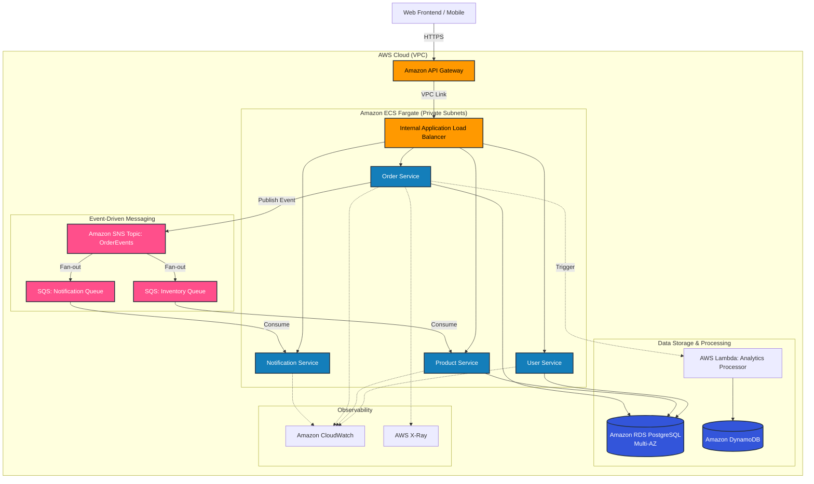
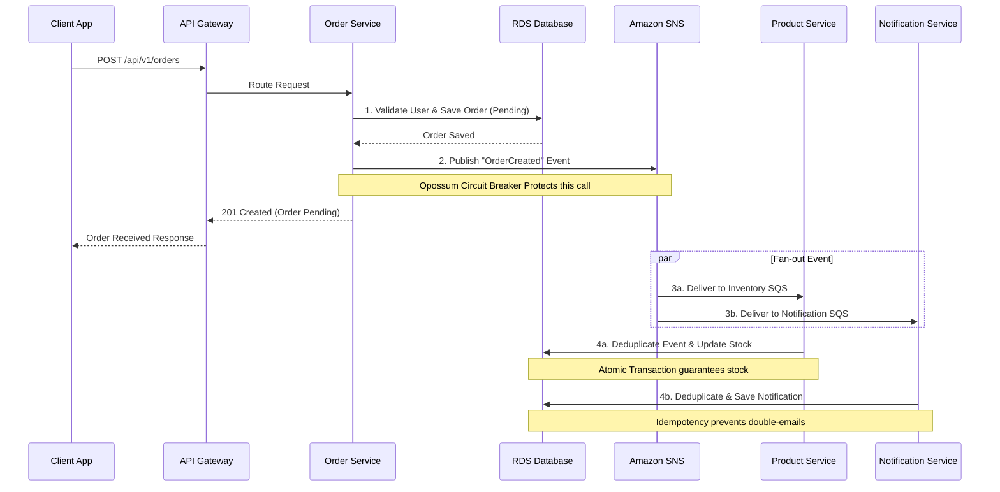

# SmartRetailX Architecture Diagrams

You can use these diagrams in your final report. If your markdown editor supports Mermaid (like GitHub, Notion, or Obsidian), you can paste the code blocks directly. Otherwise, you can paste the code into [Mermaid Live Editor](https://mermaid.live/) to export them as PNG images.

## 1. Cloud-Based Distributed Architecture Diagram

*(Note: The above uses the new Mermaid Architecture syntax. If your editor doesn't support it, use the standard Flowchart below).*

### Standard Flowchart Architecture

---

## 2. Data Flow Diagram (Event-Driven Order Processing)

This diagram satisfies the "Data Flow Diagram" requirement, specifically showing how an asynchronous order propagates through the system.

